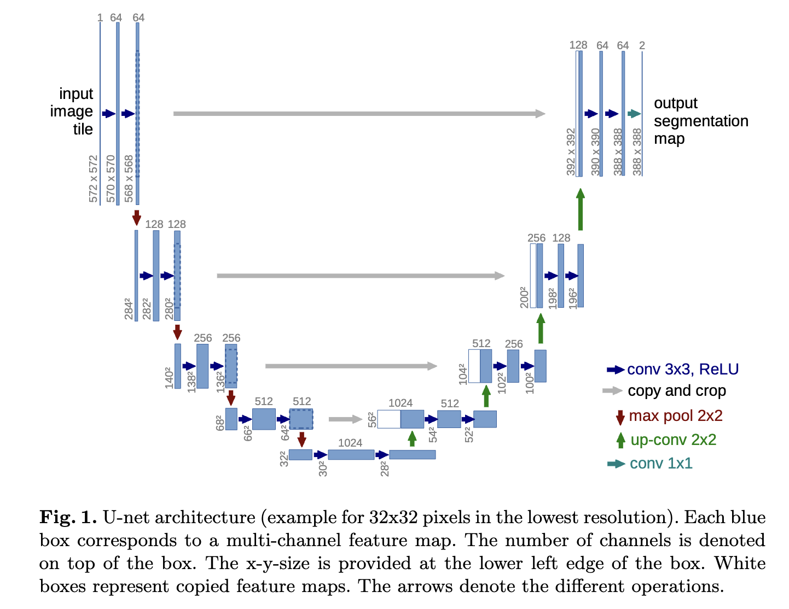

# UNet Paper Implementation using PyTorch

[](
https://github.com/drkostas/COSC525-Project1/blob/master/LICENSE)


## Table of Contents

+ [About](#about)
  + [Dataset](#dataset)
+ [Getting Started](#getting_started)
  + [Project Structure](#dir_str)
  + [Prerequisites](#prereq)
+ [Installing the Requirements](#installing)
+ [Running the Code](#run_locally)
+ [TODO](#todo)
+ [A Kind Request](#request)
+ [License](#license)

## About <a name="about"></a>

A personal project to learn about semantic segmentation using PyTorch.

Implementation of the UNet architecture as described in [Ronneberger et al.](https://arxiv.org/abs/1505.04597) for task of semantic segmentation of the Humerus Bone using X-Ray images as the input modality. 

Reproduction of results is carried out using a subset of the [MURA](https://stanfordmlgroup.github.io/competitions/mura/) dataset.

The main code is located in the [train.py](train.py) file. All other code files are imported into [train.py](train.py) for training and testing the model.

The code to perform segmentation on custom images is present in [predict.py](predict.py) file. 

For your reference, the UNet architecture diagram (from [Ronneberger et al.](https://arxiv.org/abs/1505.04597)) is attached below.



### Dataset <a name="dataset"></a> 

The images obtained from [MURA](https://stanfordmlgroup.github.io/competitions/mura/) had the X-Ray images included, without the ground truth segmentation masks. 

Hence, ground truth annotations were created using the [LabelMe](https://github.com/labelmeai/labelme.git) software. The created masks were later validated by medical professionals. 

## Getting Started <a name="getting_started"></a>

These instructions will get you a copy of the project up and running on your local machine.

### Project Structure <a name="dir_str"></a>
The project is structured as follows:
```
UNet-PyTorch/
├── config/
│   └── __init__.py
├── data/
│   ├── train/
│   │   ├── images/
│   │   └── masks/
│   └── test/
│       ├── images/
│       └── masks/
├── models/
├── requirements.txt
├── utils.py
├── data_setup.py
├── model_builder.py
├── engine.py
├── train.py
└── predict.py     
```
Ensure that your directory structure abides by the structure mentioned above. Especially, make sure your data folder is structured in the format mentioned above. For your reference, an empty `data` directory following this structure is placed in this project.


### Prerequisites <a name = "prereq"></a>

You need to have a machine with Python > 3.6 and any Bash based shell (e.g. zsh) installed:

```ShellSession
$ python3.8 -V
Python 3.8.18

$ echo $SHELL
/bin/zsh
```

## Installing the Requirements <a name="installing"></a>

Clone the repository: 
```ShellSession
$ git clone https://github.com/ajaystar8/UNet-PyTorch.git
```

Install requirements using in a new conda environment:
```ShellSession
$ conda create -n name_of_env python=3.8 --file requirements.txt
```

## Running the Code <a name="run_locally"></a>

Navigate to the [config](config/__init__.py) package and specify the following: 
+ Path to your `data` directory.
+ Path to `models` directory for saving model checkpoints.
+ Change other `hyperparameters` if necessary.

Activate the conda environment:
```ShellSession
$ conda activate name_of_env
```

To start training the model, you can call [train.py](train.py) directly. No command line arguments are necessary as the parameters have already been set in [config.py](config/__init__.py) 

## TODO <a name="todo"></a>

Read the [TODO](TODO.md) to see the current task list. 

## A Kind Request <a name="request"></a>

I have tried to adopt good coding practices as mentioned in different blogs and articles. 
However, I feel there is still a lot of room for improvement in making the code more efficient, 
modular and easy to understand.

I would be thankful if you could share your opinions by opening a GitHub Issue for the same. Your
criticisms are always welcome! 


## License <a name = "license"></a>

This project is licensed under the Apache License - see the [LICENSE](LICENSE) file for details.

